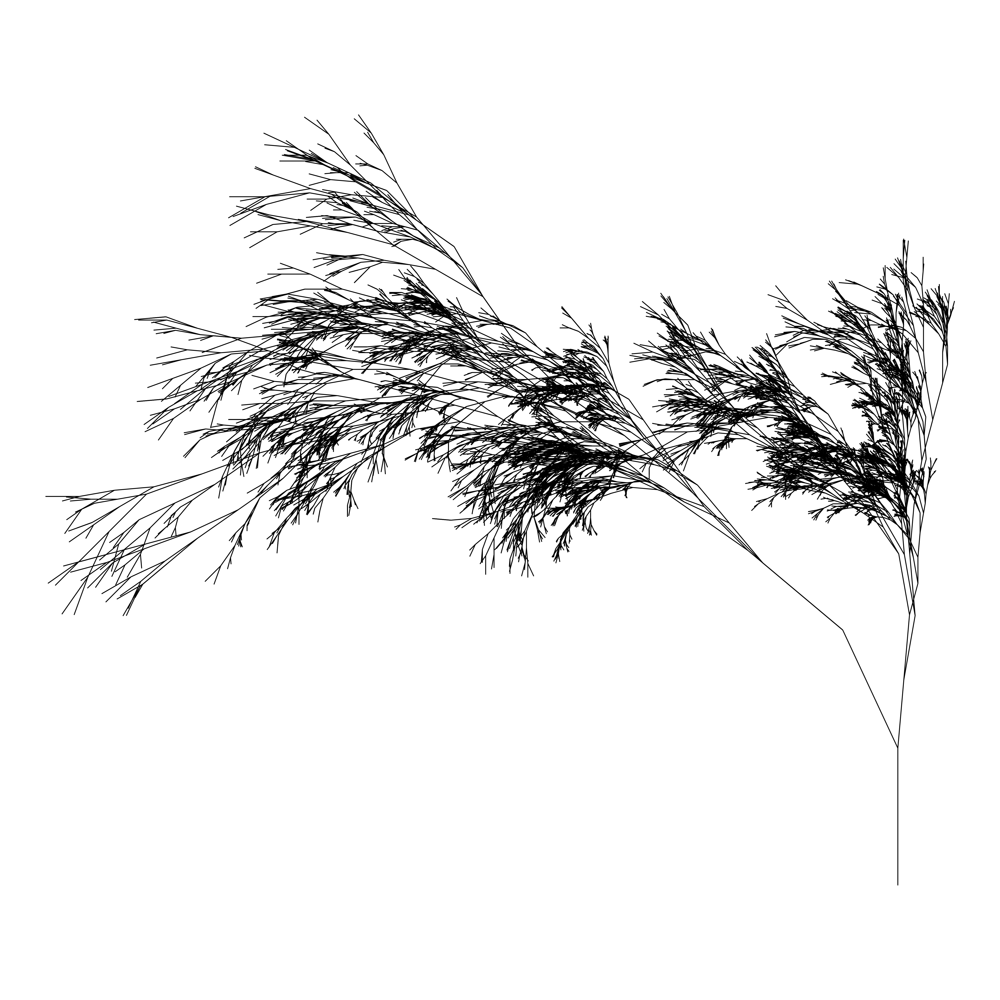

<!-- README.md is generated from README.Rmd. Please edit that file -->

# Ashtree

The `ashtree` system is a simplified version of the `flametree` package
(<https://github.com/djnavarro/flametree>) that I use for teaching
purposes. Sourcing the `ashtree.R` script creates the `ashtree.png`
file. At the default settings (see line 112) the image generated looks
like this:

